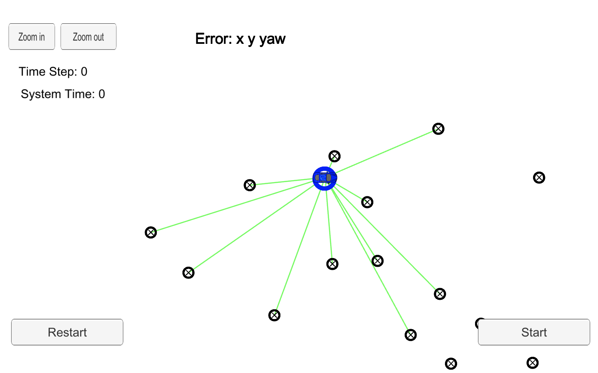

# Sparse Localizer

Project premise: Your robot has been kidnapped and transported to a new location! Luckily it has a map of this location, a (noisy) GPS estimate of its initial location, and lots of (noisy) sensor and control data.

This project implements a 2 dimensional particle filter in C++. The particle filter will be given a map and some initial localization information (analogous to what a GPS would provide). At each time step the filter will also get observation and control data.

## Running the Code
Download the simulator and open it. In the main menu screen select Project 3: Kidnapped Vehicle. The simulator can be downloaded [here](https://github.com/udacity/self-driving-car-sim/releases)

Once the scene is loaded you can hit the START button to observe how the car drives and observes landmarks. At any time you can press the PAUSE button, to pause the scene or hit the RESTART button to reset the scene. Also the ARROW KEYS can be used to move the camera around, and the top left ZOOM IN/OUT buttons can be used to focus the camera. Pressing the ESCAPE KEY returns to the simulator main menu.

This repository includes two files that can be used to set up and install uWebSocketIO for either Linux or Mac systems. For windows you can use either Docker, VMware, or even Windows 10 Bash on Ubuntu to install uWebSocketIO.

Once the install for uWebSocketIO is complete, the main program can be built and ran by doing the following from the project top directory.

1. mkdir build
2. cd build
3. cmake ..
4. make
5. ./particle_filter

Alternatively some scripts have been included to streamline this process, these can be leveraged by executing the following in the top directory of the project:

1. ./clean.sh
2. ./build.sh
3. ./run.sh

Here is the main protocol that main.cpp uses for uWebSocketIO in communicating with the simulator.

INPUT: values provided by the simulator to the c++ program

// sense noisy position data from the simulator

["sense_x"]

["sense_y"]

["sense_theta"]

// get the previous velocity and yaw rate to predict the particle's transitioned state

["previous_velocity"]

["previous_yawrate"]

// receive noisy observation data from the simulator, in a respective list of x/y values

["sense_observations_x"]

["sense_observations_y"]


OUTPUT: values provided by the c++ program to the simulator

// best particle values used for calculating the error evaluation

["best_particle_x"]

["best_particle_y"]

["best_particle_theta"]

//Optional message data used for debugging particle's sensing and associations

// for respective (x,y) sensed positions ID label

["best_particle_associations"]

// for respective (x,y) sensed positions

["best_particle_sense_x"] <= list of sensed x positions

["best_particle_sense_y"] <= list of sensed y positions

# Implementing the Particle Filter
The directory structure of this repository is as follows:

```
root
|   build.sh
|   clean.sh
|   CMakeLists.txt
|   README.md
|   run.sh
|
|___data
|   |   
|   |   map_data.txt
|   
|   
|___src
    |   helper_functions.h
    |   main.cpp
    |   map.h
    |   particle_filter.cpp
    |   particle_filter.h
```

## Inputs to the Particle Filter
You can find the inputs to the particle filter in the `data` directory.

#### The Map*
`map_data.txt` includes the position of landmarks (in meters) on an arbitrary Cartesian coordinate system. Each row has three columns
1. x position
2. y position
3. landmark id

### All other data the simulator provides, such as observations and controls.

> * Map data provided by 3D Mapping Solutions GmbH.

## Project Results

This project implements a 2 dimensional particle filter in C++. The project uses a sparse localization method to determinet the vehicle location. The main functions were implemented in particle_filter.cpp and include:

#### ParticleFilter::init
Sets the number of particles. Initializes all particles to first position (based on estimates of x, y, theta and their uncertainties from GPS) and all weights to 1. Adds random Gaussian noise to each particle.

number of particles chosen to run in under 100 seconds was 100 particles - found empirically.

#### ParticleFilter::prediction 

Adds measurements to each particle and add random Gaussian noise.

#### ParticleFilter::dataAssociation

Finds the predicted measurement that is closest to each observed measurement and assign the observed measurement to this particular landmark.

#### ParticleFilter::updateWeights

Updates the weights of each particle using a mult-variate Gaussian distribution. The observations are given in the VEHICLE'S coordinate system. The particles are located according to the MAP'S coordinate system. There was a homogeneous transform between the two systems.This transformation required both rotation AND translation (but no scaling).

#### ParticleFilter::resample

Resamples the particles with replacement with probability proportional to their weight using a resample wheel method. 

#### Simulation

The particle filter connects to the simulation using the web socket. After connection the following image is seen in the simulation.



Once the simulation is started with the particle filter the car localizes itself based on the observed landmarks.


The particle filter localize the vehicle to within the desired accuracy.
The particle filter runs within the specified time of 100 seconds.


